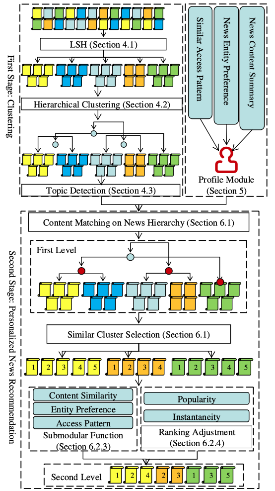

# SCENE : A Scalable Two-Stage Personalized News Recommendation System

**Contribute**:

Propose a Scalable two-stage Personalize news recommendation approach with a two-level representation
* First level consist various topics relevant to users’ preference and divide into group
* 2$^{nd}$ level includes specific news articles and recommend news items

Principled framework for news selection good balance between the novelty and diversity

Multi-factor high-quality user profile construction

**SCENE**: Consists of 3 Major components:
* Newly-Published News Articles Clustering
  * Partition newly published news into small groups by **Locality Sensitive Hashing**
  * Hierarchically separate groups with average-link. Then LM **Probabilistic Latent Semantic Indexing** (PLSI) and **Latent Dirichlet Allocation** (LDA) applied to summarizing news articles
* User Profile Contruction
  * Constructed in: News topic distribution, Similar access patterns and news entity preference (which are all extracted from user's read history)
* Personalized News Items Recommendation
  * Compare the topic distributions of cluster and news content
  * Then sequentially select the clusters based on Similarity ($1^{st}$ level)
  * Continue compare Similarities of small news group and user's accesed news content (most similar groups as $2^{nd}$ level)
  * In the most similar groups are model personalized news recommendation by greedy way 
## Recommendation Framework

## Methods in Framework
### News article clustering
* Decompose news articles to shingles 
  * Preprocessing: remove stop words, tokenize and stemm 
  * Shingling articles with $k = 10$ into matrix $M$ with rows is shingles and columns is articles
* MinHasing
  * Contruct Randomized 100 length Minhash signature 
* Locality Sensitive Hashing
  * Signatures are initally decomposed into multiple bands, then use standard hash function  to hash into a big hash table (band length  = 5)
  * Then separated news corpus into small news groups by Jaccard-based

### News topic Detection
* Detecting topics of a text corpus done by using probabilistic language models as  PLSI or LDA, by extracting a list of represent words from corpus. 

### User Profile Contruction
* Built by eploration on: News content, Similar access patterns and preferred news entities
  * Each User profile can be present : $\mathcal{U =<T,P,E>}$
    * $\mathcal{T}$ represent topic distribution of news that user access in the past $\mathcal{\{<t_1, w_1>, <t_2, w_2>,...\}}$ with corresponding weight
    * $\mathcal{P}$ represent list of user $<u_1, u_2,...>$ similar access pattens with given user
    * $\mathcal{E}$ represent list of named entities $<e_1, e_2, ...>$ from user's reading history
  * **News content summarize** by use represent users’ reading history as the same as the representations for news groups
  * **Access pattern** is built by calulating pairwise similarity between user given and orther user's reading history with Jacard-Sim. Similarity score is predefined by theshold.
  * **Name entities** is built by NLP task. "Each news article is associated with a list of named entities along with their corresponding entity types"
  
### Personalized Recommendation
  #### Interest Matching for Representation Lv.1
  * Ranking by cosine similarity between topic distribution of each cluster $\mathcal{T_C}$ and user’s profile $\mathcal{T_U}$
  * Choose the clusters with the score greater than dynamic threshold
  * Dig into each cluster and choose the news group most similar to the user’s interest
  #### News Selection for Representation Lv.2
  * **News Profile** helpful to compare two news, and evaluate how the news item can satisfy the user’s reading preference
    * News profile $\mathcal{F_n = <T_n, P_n, E_n>}$ and User's profile $\mathcal{F_u = <T_u, P_u, E_u>}$, and Similarity of them is computed:
  $$\mathcal{Sim(F_n, F_u) = \frac{\alpha Sim(T_n,T_u) + \beta Sim(P_n, P_u) + \gamma Sim(E_n, E_u)}{\sqrt{\alpha^2 + \beta^2 + \gamma^2}}}$$
  Where ${\alpha, \beta, \gamma}$ are parameters to control how we trust the corresponding components
    
  $Sim(T_n,T_u)$ is computed by Cosin similarity
  
  $Sim(P_n, P_u), Sim(E_n, E_u)$ is computed by Jaccard similarity
  
  #### Submodularity
  Tyically, a news reader is not interested all of aspects in the given topic. So, news selection strategy can be described as follows:
  ( $\mathcal{N}$ is original news group, $\mathcal{S}$ is selected news set, $\mathcal{\zeta}$ is the news being selected ). 
  
  After selecting $\zeta$:
  * $S$ should be similar to the general topic in $N\ \backslash S$;
  * The topic  topic diversity should not deviate much in $S$;
  * $S$ should provide more satisfaction to the given user’s reading preference
  
  Quality function $f$ to evaluate the news set $S$:
  $$
  \mathcal{ f(S) = \frac{1}{|N \backslash S|.|S|}\sum_{n_1\in N \backslash S }{\sum_{n_2 \in S}{sim(n_1, n_2)}} + \frac{1}{(\begin{aligned}
  |S| \\ 2
  \end{aligned})} \sum_{\begin{aligned}
    n_1,n_2 \in S \\
    n_1 \neq n_2
  \end{aligned}}{-sim(n_1,n_2)} + \frac{1}{|S|} \sum_{n_1 \in S}{sim(u, n_1)}
  }$$ 
  $n_1$ and $n_2$ denote news items, $u$ denote given user

  Three components are involved:
  * The first one aims to evaluate the quality of selected news set $\mathcal S$ over original
  * The second one provides a perspective on how diverse that the top- ics underlying the selected news articles
  * The last one is evidence that how much the user’s preference is satisfied by $\mathcal S$ 
  
  #### Ranking Adjustment
  The ranking of the selected news articles(popularity and recency) need to be adjusted for more reasonable by normalized two types of properties

  Given $\mathcal n$, the popularity $\mathcal n_P$ and the recency $\mathcal n_I$ can be combined as
  $$n_\phi = \frac{n_P-n_{P_{min}}}{n_{p_{max}}- n_{p_{min}} } - \frac{n_I - n_{I_{min}}}{n_{I_{max}} - n_{I_{min}}}.$$

  Recency is restricted by time

  The generated ranking can emphasize more popular and fresh news items
